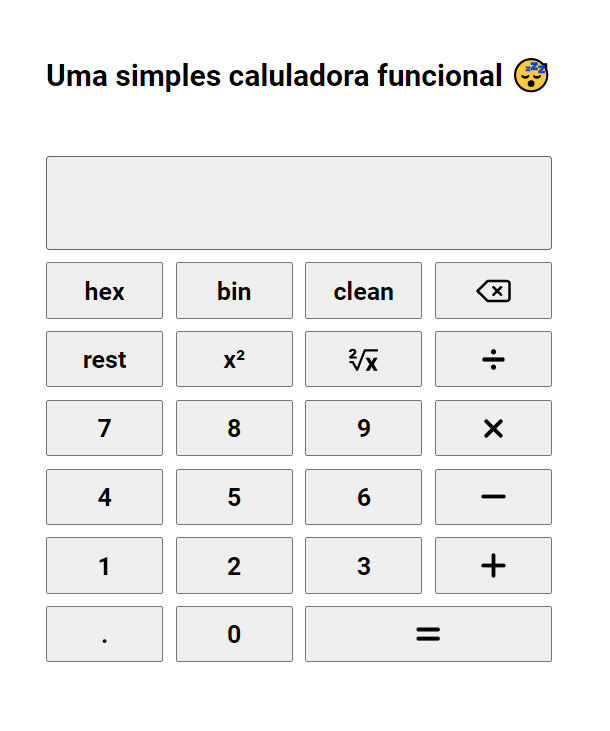
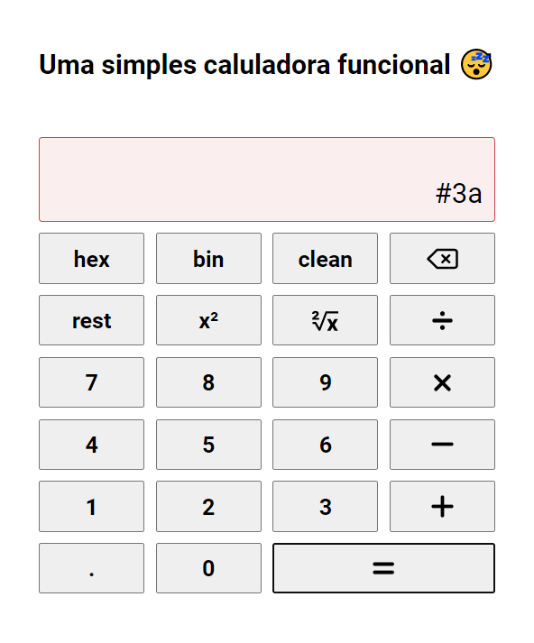
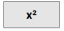
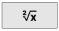
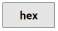
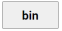

# Uma Simples Calculadora Funcional 😴

## Sobre

Este é um projeto de calculadora funcional, feito em uma pagina html dinâmca com Kotlin.

## Como funciona
A calculadora é simples e utliza uma arvore binaria para calcular o resultado a partir da expressão salva em string.  
Ao digitar o teclado a aplicação filtra os caracteres invalidos, automaticamente.
A calculadora só gera a arvora na hora de clacular o resultado, economizando mémoria da maquina.

Ao pressionar "Enter" ou o botão de igual a calculadora resolve a expressão e exibe o resultado em tela.
Caso a expressão esteja incorreta, ou ocorra algum erro interno a aplição ira indicar mudando a cor da área com a expressão: 

## Comandos:

* #### Igual 
  Aperte o botão  ou pressione Enter para Calular o resultado da expressão.
* #### Backspace 
  Aperte o botão  para remover o digito elemento adicionado da expressão.
* #### Clear 
  Aperte o botão  para limpar/esvaziar o campo da expressão.
* #### Ao quadrado 
  Aperte o botão  para calular o resultado da expressão ao quadrado.
* #### Raiz quadrada 
  Aperte o botão  para calular a raiz quadrada do resultado da expressão.
* #### Hex 
  Aperte o botão  para calular o resultado da expressão em hexadecimal.
* #### Bin 
  Aperte o botão  para calular o resultado da expressão em binario.

#### Os demais comandos são para adicionar seus respectivos caracteres à expressão!

[Repositorio](https://github.com/commonProgrammerr/Projeto-de-LPF-Calculadora-Funcional)
da aplicação.